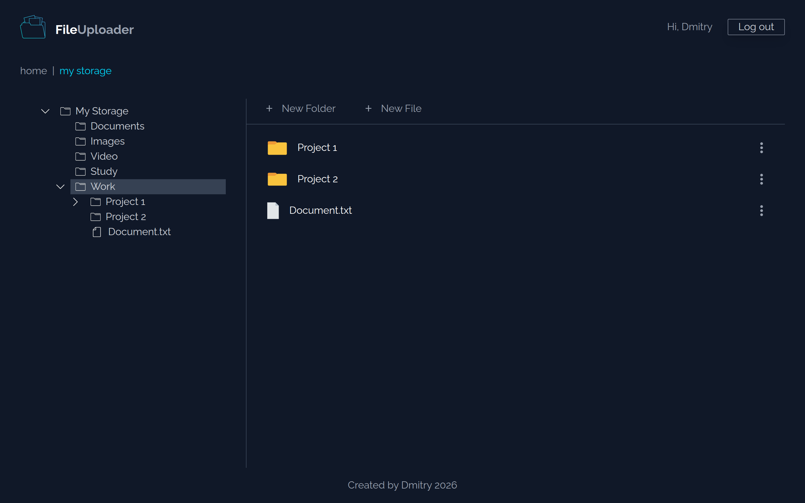
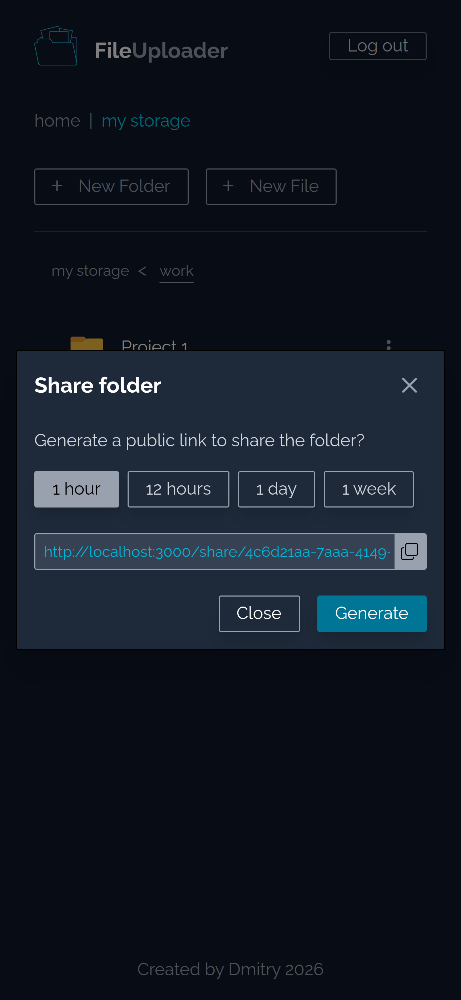

# File Uploader

[Live Version](https://file-uploader-n2f8.onrender.com) 

A full-stack (backend-focused) file uploader application. The goal of this project is to create a file storage (something similar to google drive), also to practice using Prisma ORM to work with Postgresql database and using multer to work with files. This project built with the following tech stack:

**Frontend:**  
- EJS templates
- Styling: Tailwind CSS (tried it for the first time)

**Backend:**  
- Node.js, Express  
- Database: PostgreSQL, Prisma ORM
- Authentication: Passport.js (Local strategy)
- File Storage: Cloudinary, Multer
- Validation: express-validator
- Session Management: express-session, connect-pg-simple
- Deployment: Render (app server), Cloudinary (files storage), Neon (postgresql database server)

 **Features:**
- Folder Management: Create, delete, rename, share folder and to create a folder structure (nested folders).
- Folder Sharing: Share folders by using a generated shared link.
- Access Control: Set expiration dates for shared links.
- Authentication: Secure user sessions with PassportJS and Prisma Session Store.
- Cloud Storage: upload and download files with Cloudinary Storage.
- Validation: forms validation with express-validator.

## Screenshots
<table border="1" style="width:100%">
  <tr>
    <td></td>
    <td width="240"></td>
  </tr>
</table>